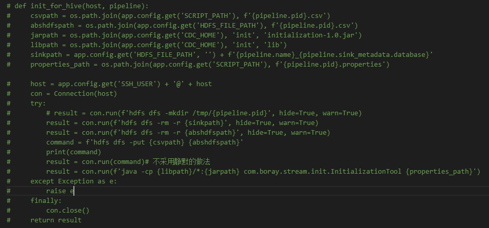

HDFS

http://192.168.120.66:50070/dfshealth.html#tab-overview


CDC 相关的配置文件在 120.66:/etc/rapids/cdc

CDC root/rdpadmin   rapids/rdpuser

psql -h 192.168.120.66 -p 5432 -U root tdb （密码123456）

mysql -h 192.168.120.68 -P 3306 -u root -pMyNewPass4!

66上那个mysql root密码rapids


查看磁盘占用与大文件

du -sh /

df -h /


DB-Hudi

-   [x] db source导出的过程中，使用函数的方式case不支持的字段类型，譬如boolean的0/1 mapping spark的True/False，导出到csv中，使用hudi脚本导入hudi，这个你只需要mapping前面的source数据，不需要熟悉hudi，使用我的工具就可以了，还有查看Spark支持的csv的字符串格式(boolean, timestamp)
-   [ ] 保留之前说过的staging方式，使用db-spark的方式mapping，但需要解决spark-hudi的问题，这个今天在会议上Robert说让你去调研这个问题，作为你q4工作的一部分，具体我们遇到的问题是，spark中建表并不能同步到hudi api建的表中，你需要调研如何在导入一张hudi外部的table进hudi table


1.  先将 CSV 文件上传到 HDFS 中。

    ```sh
    hdfs dfs -put ./TCM-Temp/MYSQL_to_HUDI_lineitem_test_mysql.csv hdfs://cdc/tmp/
    
    hdfs dfs -find hdfs://cdc/tmp/MYSQL_to_HUDI_lineitem_test_mysql.csv
    
    hdfs dfs -rm hdfs://cdc/tmp/MYSQL_to_HUDI_lineitem_test_mysql.csv
    ```

    

2.  调用 相应的工具。

-   调用前 请删掉 HDFS 上的 `hive.hdfs.path=hdfs://cdc/tmp/test1_hudi` 文件，里面是存放 Tools 生成的缓存数据文件。
-   请删掉原本的 *.avsc 文件，这是 Tools 生成数据表的记录文件。
-   put CSV 文件到 HDFS 上时，请删原有的 CSV 文件。


[Spark-Shell](https://spark.apache.org/docs/latest/quick-start.html)   [Spark-Shell Command](https://spark.apache.org/docs/3.2.0/submitting-applications.html)

[Hudi](https://hudi.apache.org/docs/quick-start-guide/)

使用 Spark 连接 hudi

```sh
cd /opt/CDC/spark/

./bin/spark-shell \
--jars /opt/CDC/kafka/plugins/kafka-connect-hive/hudi-spark-bundle_2.11-0.8.0.jar \
--master local[2] \
--driver-class-path /etc/rapids/cdc/hadoop \
--conf spark.sql.hive.convertMetastoreParquet=false \
--deploy-mode client \
--driver-memory 1G \
--executor-memory 2G \
--num-executors 1 \
--packages org.apache.spark:spark-avro_2.11:2.4.4


./bin/spark-shell \
--jars /opt/CDC/spark/jars/hudi-spark-bundle_2.11-0.8.0.jar \
--master local[2] \
--driver-class-path $HADOOP_CONF_DIR \
--conf spark.sql.hive.convertMetastoreParquet=false \
--deploy-mode client \
--driver-memory 2G \
--executor-memory 2G \
--num-executors 2 \
--packages org.apache.spark:spark-avro_2.11:2.4.4

spark.sql(s"show databases").show()
spark.sql(s"use test_cdc_hudi").show()
spark.sql(s"show tables").show()
spark.sql(s"select * from test1_hudi_ro").show()
spark.sql(s"drop table test1_hudi_ro").show()
```


刚刚那封邮件比较旧，我发现运行方式是错误的应该改成这样运行

 java -cp lib/*:initialization-1.0.jar com.boray.stream.init.InitializationTool config/test.properties

